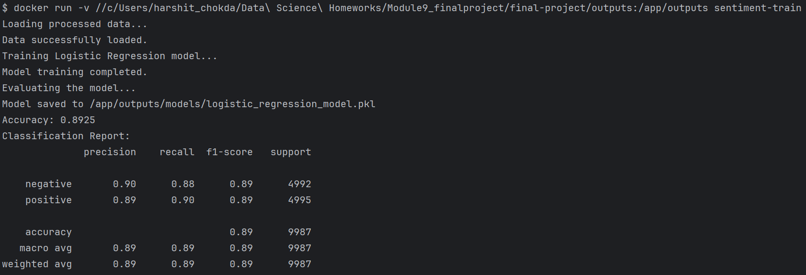
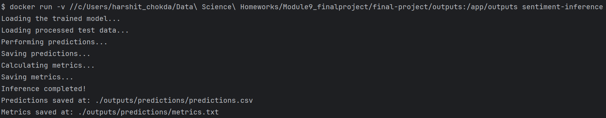

# Sentiment Analysis Project: Binary Classification of Movie Reviews

# DS Part :

## Introduction

This project involves building a binary sentiment classification model for movie reviews, with labels indicating positive or negative sentiments. The dataset used contains 50,000 movie reviews, split into training and testing sets. The objective is to accurately predict the sentiment of a review using machine learning techniques.

## Tools and Libraries Used

- **Google Colab** (for implementation)
- **Python Libraries**: Pandas, NumPy, Matplotlib, Seaborn, Scikit-learn, and NLTK

## Exploratory Data Analysis (EDA)

### Key Insights:

- The dataset is balanced, with an equal number of positive and negative reviews (25,000 each in the training set).
  
### Review Lengths:

- **Word count**: Ranges from 10 to 2,500 words, with an average of ~300 words.
- **Character count**: Average of ~1,500 characters per review.

Sentiments are equally distributed, eliminating the need for data balancing techniques.

### Visualizations:

- **Histograms** for word and character counts revealed right-skewed distributions.
- **Word clouds** highlighted common words for both positive and negative sentiments.

## Text Preprocessing

### Steps Performed:

- **Tokenization**: Split text into individual words.
- **Stop-word Removal**: Removed common words (e.g., "the", "and", "is") to focus on meaningful terms.

### Comparison: Stemming vs Lemmatization:

- **Stemming**: Reduced words to their base forms but introduced readability issues (e.g., "running" → "run").
- **Lemmatization**: Retained meaningful forms of words and preserved context (e.g., "running" → "running").

**Conclusion**: Lemmatization was chosen for better semantic retention.

### Vectorization:

- **TF-IDF Vectorization**: Performed better than Count Vectorization by emphasizing important words while down-weighting frequent but less meaningful ones.

## Modeling

### Models Explored:

- **Logistic Regression**
- **Support Vector Machine (SVM)**
- **Naive Bayes**
- **Random Forest Classifier**

### Performance Comparison:

| Model               | Precision (Negative) | Recall (Negative) | F1-Score (Negative) | Precision (Positive) | Recall (Positive) | F1-Score (Positive) | Accuracy |
|---------------------|----------------------|-------------------|---------------------|----------------------|-------------------|---------------------|----------|
| Logistic Regression  | 0.90                 | 0.89              | 0.89                | 0.89                 | 0.90              | 0.89                | 0.89     |
| SVM                 | 0.90                 | 0.87              | 0.88                | 0.89                 | 0.90              | 0.90                | 0.90     |
| Naive Bayes         | 0.86                 | 0.84              | 0.85                | 0.85                 | 0.85              | 0.87                | 0.87     |
| Random Forest       | 0.84                 | 0.86              | 0.85                | 0.85                 | 0.83              | 0.84                | 0.84     |

## Final Model Selection:

- **Logistic Regression** was chosen as the final model due to its highest overall accuracy (89%) and balanced performance across all metrics.

## Overall Performance Evaluation

The **Logistic Regression model** achieved:

- **Accuracy**: 89%
- **F1-Score**: 0.89 (both positive and negative classes)

This demonstrates the model's ability to generalize well on unseen data.

## Business Applications

1. **Customer Feedback Analysis**: Understanding customer sentiment from reviews can help businesses improve their products or services.
2. **Content Moderation**: Automatically flagging negative reviews for quick resolution.
3. **Market Research**: Identifying trends and patterns in customer opinions.

---

# MLE Part :

## Introduction

The objective of this part of the project is to implement machine learning operations (MLE) for binary sentiment classification of movie reviews. Using the Logistic Regression model, the task is to train a model on pre-processed data, perform inference, and evaluate the performance metrics of the model.

## Directory Structure

The project follows a structured directory layout for clear organization and management of files:

- **data/**: Contains training and inference datasets.
  - **processed/**: Processed datasets for training and testing.
    - `test_features.npz`: Processed test feature data.
    - `test_labels.npy`: Processed test labels.
    - `train_features.npz`: Processed training feature data.
    - `train_labels.npy`: Processed training labels.
  - **raw/**: Raw data files before preprocessing.
    - `test.csv`: Raw test data.
    - `train.csv`: Raw training data.

- **notebooks/**: Jupyter notebook(s) for data science analysis.
  - `DS_part.ipynb`: Notebook for data science part of the project.

- **outputs/**: Stores model files and prediction results.
  - **models/**: Contains saved models and their metadata.
    - `logistic_regression_model.pkl`: Trained Logistic Regression model.
    - `metrics.txt`: Model evaluation metrics.

- **src/**: Contains all source code for training and inference.
  - **inference/**: Inference-related scripts and Dockerfile.
    - `Dockerfile`: Dockerfile for building the inference image.
    - `inference.py`: Python script for inference.
  - **train/**: Training-related scripts and Dockerfile.
    - `Dockerfile`: Dockerfile for building the training image.
    - `train.py`: Python script for training the model.

- **requirements.txt**: Lists the dependencies required to run the project.


## Tools and Libraries Used

- **Python**: For data processing, model training, and evaluation.
- **Scikit-learn**: Used for implementing Logistic Regression and evaluation metrics.
- **NumPy**: For numerical operations.
- **Docker**: To containerize and manage the training and inference processes.
- **Joblib**: For saving and loading the trained model.

## Workflow Overview

1. **Training Model (`train.py`)**:
    - Load pre-processed training and test data.
    - Train a Logistic Regression model.
    - Evaluate the model and save the trained model and metrics.
    - The model is saved as a `.pkl` file, and metrics are saved to a `.txt` file.

2. **Inference (`inference.py`)**:
    - Load the trained model.
    - Load pre-processed test data.
    - Perform predictions on the test data.
    - Calculate evaluation metrics.
    - Save predictions and metrics to output directories.

## Model Training Process

The `train.py` script runs the Logistic Regression model training and evaluation. Here's how it works:

1. **Loading Data**: The script loads the processed training and testing features from the `/data/processed/` directory and their corresponding labels.
2. **Model Training**: Logistic Regression is trained on the training dataset (`train_features.npz` and `train_labels.npy`).
3. **Evaluation**: After training, the model is evaluated on the test data, and a classification report is generated. The accuracy of the model is calculated and saved along with the full classification report.
4. **Saving Results**: The model is saved in the `/outputs/models/` directory as `logistic_regression_model.pkl`. The evaluation metrics are saved in `/outputs/metrics.txt`.




## Inference Process

Once the model is trained, the `inference.py` script performs the inference on new data using the trained model:

1. **Loading the Model**: The trained model (`logistic_regression_model.pkl`) is loaded from the `/outputs/models/` directory.
2. **Loading Test Data**: The test features are loaded from the `/data/processed/` directory.
3. **Making Predictions**: The model performs predictions on the test set.
4. **Metrics Calculation**: The performance metrics (accuracy, precision, recall, F1-score) are calculated and saved.
5. **Saving Predictions and Metrics**: The predictions and evaluation metrics are saved in the `/outputs/predictions/` directory.




## Dockerization

Both the training and inference processes are dockerized for consistency and portability:

1. **Training Docker Image**:
    - Built from the `Dockerfile` in the `/src/train/` directory.
    - The container runs `train.py` and outputs the trained model and evaluation metrics.

2. **Inference Docker Image**:
    - Built from the `Dockerfile` in the `/src/inference/` directory.
    - The container runs `inference.py` and outputs the predictions and evaluation metrics.

To build and run the Docker containers:

## How to Run

### Prerequisites

1. **Clone the repository** to your local machine:
    ```bash
    git clone <repository_url>
    cd <repository_folder>
    ```
   i.e. repository_folder (final-project)

2. **Ensure that you have Docker installed** on your machine. If not, you can download and install Docker from [here](https://www.docker.com/products/docker-desktop).

### Steps

#### 1. Train the Logistic Regression Model

To train the Logistic Regression model using the pre-processed data, run the following command inside the cloned repo folder:

```bash
docker run -v $(pwd)/outputs:/app/outputs sentiment-train
```
- This will load the pre-processed training data (which is already available in the repository after cloning).
- The model will be trained and evaluated, and the results (metrics) will be saved in the outputs folder.
- The trained model will be saved as logistic_regression_model.pkl.

**If this below error is shown:**

docker: invalid reference format: 
repository name (library/Science) must be lowercase.

You can check your pwd by using the following command:

```bash
echo $(pwd)/outputs
```

Example pwd: /c/Users/harshit_chokda/Data Science Homeworks/Module9_finalproject/final-project/outputs


Then this was used: 

```bash
docker run -v /c/Users/harshit_chokda/Data\ Science\ Homeworks/Module9_finalproject/final-project/outputs:/app/outputs sentiment-train
```

- The issue comes from spaces in the directory name (Data Science Homeworks). In Linux, paths with spaces need to be escaped using a backslash.
- This will ensure that Docker can correctly interpret the full path and mount the volume.

#### 2. Run Inference on the Test Data

To perform inference using the trained model, run the following command:

```bash
docker run -v $(pwd)/outputs:/app/outputs sentiment-inference
```
- This will load the trained model and the test data, perform predictions, and save the results in the outputs/predictions folder.
- The predictions will be saved as predictions.csv, and the evaluation metrics will be saved as metrics.txt.

If the previous error shows, then follow the same process for inference part.

## Model Evaluation

- **Training Accuracy:** 89.25%
- **Evaluation Metrics:**
   - **Precision:** 0.90 (Negative), 0.89 (Positive)
   - **Recall:** 0.88 (Negative), 0.90 (Positive)
   - **F1-Score:** 0.89 (Negative), 0.89 (Positive)

## Conclusion

The Logistic Regression model achieved a strong balance between precision, recall, and F1-score, with an overall accuracy of 89.25%.

---